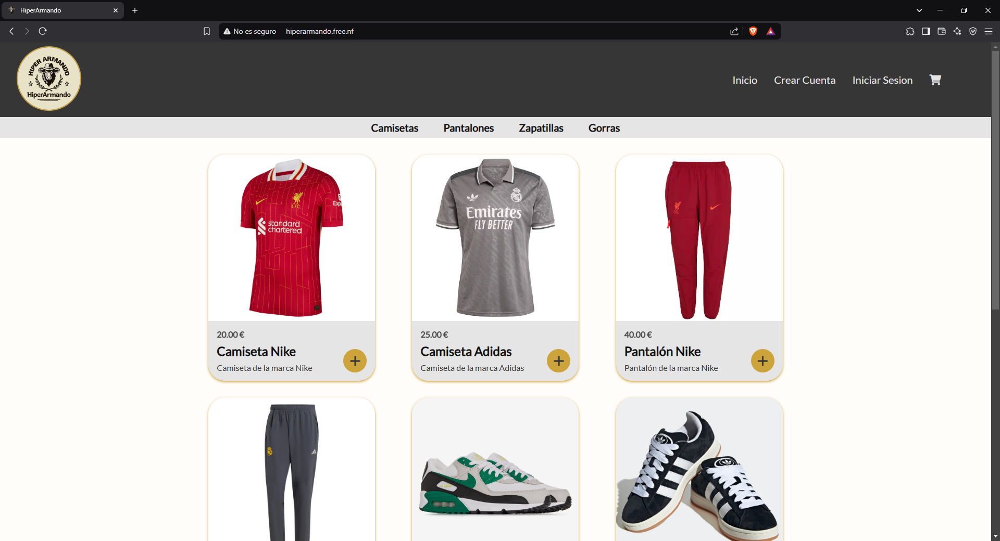
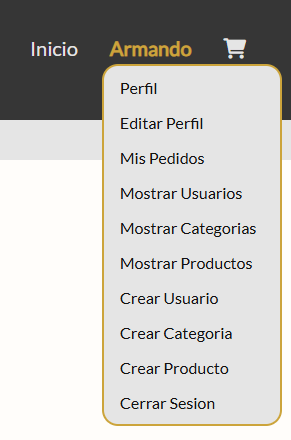
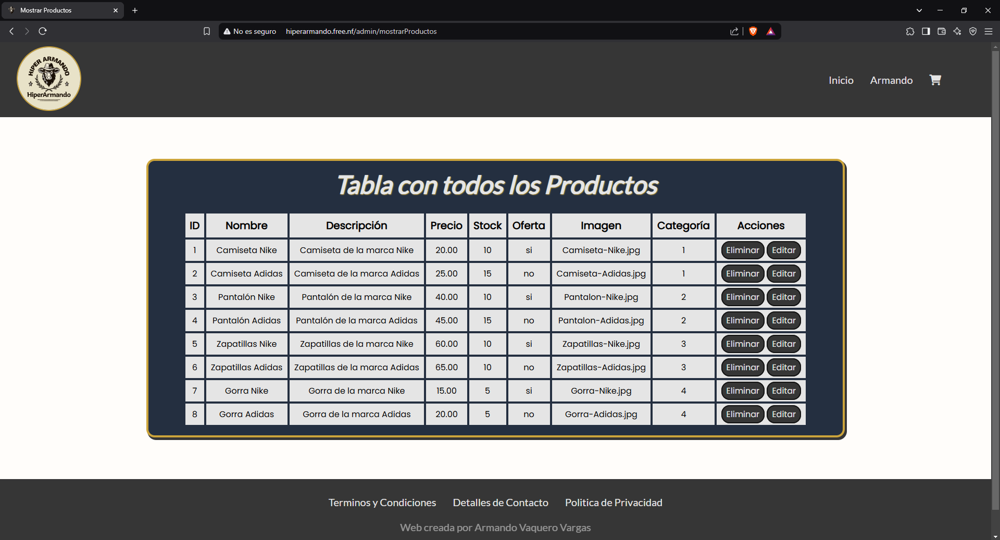
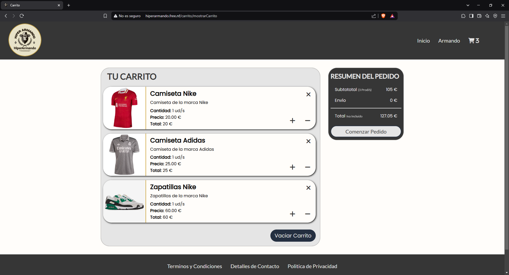
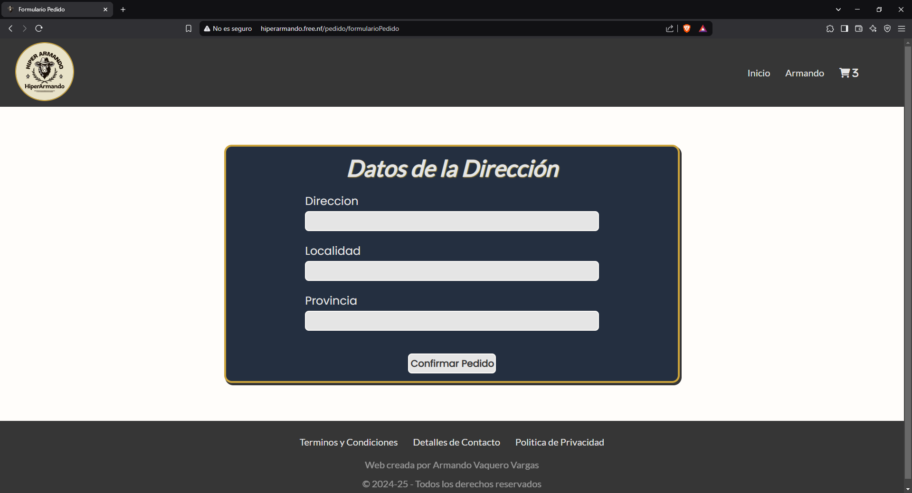
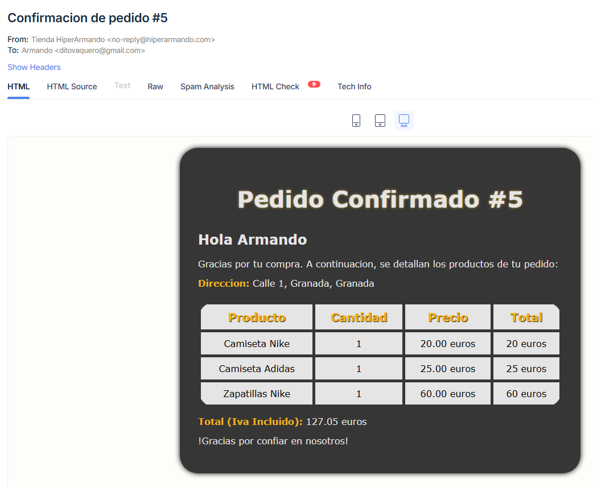

# DWESE_ProyectoTienda
Repositorio dedicado al Proyecto final Tienda de la asignatura Desarrollo Web en Entorno Servidor (PHP)
> [!NOTE]
> ## Descripción del Repositorio
> Este repositorio contiene el proyecto **HiperArmando**, desarrollado para la asignatura **Desarrollo Web en Entorno Servidor** como parte del curso de **2º DAW**.
> 
> El objetivo del proyecto es:
> - Diseñar una tienda en línea.
> - Gestión de usuarios.
> - Gestión de productos.
> - Gestión del carrito de compra.
> - Gestión de las categorías.
> - Gestión de pedidos.
>
> Creado por: **Armando Vaquero Vargas**  

## Índice
- [DWESE\_ProyectoTienda](#dwese_proyectotienda)
  - [Índice](#índice)
  - [1. Requisitos](#1-requisitos)
  - [2. Estructura del Proyecto](#2-estructura-del-proyecto)
    - [2.1. Descripción General](#21-descripción-general)
    - [2.2. Descripción Detallada](#22-descripción-detallada)
  - [3. Navegación](#3-navegación)
    - [3.1. Navegación General](#31-navegación-general)
    - [3.2. Ejemplo de Uso](#32-ejemplo-de-uso)
  - [4. Configuración del Correo](#4-configuración-del-correo)
    - [4.1. Variables de Entorno](#41-variables-de-entorno)
    - [4.2. Clase Correo](#42-clase-correo)
  - [5. Seguridad](#5-seguridad)
    - [5.1. Ocultar Credenciales](#51-ocultar-credenciales)
    - [5.2. Prevención de Inyección SQL](#52-prevención-de-inyección-sql)
    - [5.3. Autenticación y Cookies](#53-autenticación-y-cookies)
  - [6. Instalación y Configuración](#6-instalación-y-configuración)
  - [7. Despliegue](#7-despliegue)
    - [7.1. Imágenes del Proyecto](#71-imágenes-del-proyecto)

## 1. Requisitos
Para poder realizar el desarrollo de este proyecto se han utilizado las herramientas y tecnologías:
- **XAMPP**: Permite la configuración de un entorno de desarrollo local, pudiendo ejecutar un servidor web y una base de datos de manera integrada:
  - **PHP**: Como lenguaje de programación principal para el desarrollo de la lógica del servidor y la aplicación web.
  - **MySQL**: Para la gestión de la base de datos, almacenando la información sobre usuarios, productos, pedidos, etc.
- **Visual Studio Code**: Permite la edición de código fuente.
- **Composer**: Usado para instalar y gestionar las librerías externas necesarias en el proyecto:
  - *Dependencias*:
    - **PHP-Dotenv**: Para cargar de forma segura las variables de entorno desde el archivo `.env`, evitando exponer credenciales sensibles en el código fuente.
    - **PHPMailer**: Para gestionar el envío de correos electrónicos de confirmación del pedido, utilizando **MailTrap** para pruebas en desarrollo.
  - *Comandos Relevantes*:
    - `composer init`: Para inicializar el paquete *composer.json*.
    - `composer require vlucas/phpdotenv`: Para instalar el paquete **PHP-Dotenv**.
    - `composer require phpmailer/phpmailer`: Para instalar el paquete **PHPMailer**.
    - `composer dump-autoload`: Para actualizar el autoloader cada vez que se realizan cambios en la estructura o se añaden nuevas clases.

> [!NOTE]
> Para instalar **Composer** hay que tener en cuenta que puede causar problemas con el antivirus, por lo que si ocurre algún error durante la instalación es necesario desactivar el antivirus y proceder con la instalación.

## 2. Estructura del Proyecto
### 2.1. Descripción General
```
/hiperarmando/                                                         
├─ /app/                              
│   ├─ /Controllers/                  
│   │   ├─ CarritoController.php       -> Controla las acciones del Carrito de Compra.
│   │   ├─ CategoriaController.php     -> Controla las acciones de las Categorías de Productos.
│   │   ├─ ErrorController.php         -> Controla las acciones de Error 404.
│   │   ├─ HomeController.php          -> Controla las acciones de la Página Principal o de inicio.
│   │   ├─ PedidoController.php        -> Controla las acciones del Proceso de Pedido.
│   │   ├─ ProductoController.php      -> Controla las acciones de los Productos.
│   │   └─ UsuarioController.php       -> Controla las acciones de los Usuarios.
│   │                                
│   ├─ /Models/                       
│   │   ├─ Categoria.php               -> Modelo de la entidad Categoría (Atributos y Métodos).
│   │   ├─ Pedido.php                  -> Modelo de la entidad Pedido (Atributos y Métodos).
│   │   ├─ Producto.php                -> Modelo de la entidad Producto (Atributos y Métodos).
│   │   └─ Usuario.php                 -> Modelo de la entidad Usuario (Atributos y Métodos).
│   │                                
│   ├─ /Repositories/                 
│   │   ├─ CategoriaRepository.php     -> Gestiona las consultas de las Categorías en la BBDD.
│   │   ├─ PedidoRepository.php        -> Gestiona las consultas de los Pedidos en la BBDD.
│   │   ├─ ProductoRepository.php      -> Gestiona las consultas de los Productos en la BBDD.
│   │   └─ UsuarioRepository.php       -> Gestiona las consultas de los Usuarios en la BBDD.
│   │                                
│   ├─ /Services/                     
│   │   ├─ CategoriaServices.php       -> Lógica de negocio para la gestión de Categorías.
│   │   ├─ PedidoServices.php          -> Lógica de negocio para la gestión de Pedidos.
│   │   ├─ ProductoServices.php        -> Lógica de negocio para la gestión de Productos.
│   │   └─ UsuarioServices.php         -> Lógica de negocio para la gestión de Usuario.
│   │                                
│   ├─ /Views/  
│   │   ├─ /admin/ 
│   │   │   ├─ actualizarProducto.php  -> Vista para actualizar un Producto.
│   │   │   ├─ crearCategoria.php      -> Vista para crear una nueva Categoría.
│   │   │   ├─ crearProducto.php       -> Vista para crear un nuevo Producto.
│   │   │   ├─ mostrarCategorias.php   -> Vista para mostrar la lista de Categorías.
│   │   │   ├─ mostrarProductos.php    -> Vista para mostrar la lista de Productos.
│   │   │   └─ mostrarUsuarios.php     -> Vista para mostrar la lista de Usuarios.
│   │   │                    
│   │   ├─ /carrito/  
│   │   │   └─ mostrarCarrito.php      -> Vista para mostrar el contenido del Carrito de Compra.
│   │   │
│   │   ├─ /error/  
│   │   │   └─ error404.php               -> Vista para mostrar el Error 404.
│   │   │                            
│   │   ├─ /home/     
│   │   │   └─ index.php               -> Vista de la Página Principal o de inicio.
│   │   │                            
│   │   ├─ /layout/                   
│   │   │   ├─ footer.php              -> Plantilla del pie de página de la web.
│   │   │   ├─ header.php              -> Plantilla del encabezado de la web.
│   │   │   └─ layout.php              -> Layout que incluye header, footer y el contenido dinámico.
│   │   │                            
│   │   ├─ /pedido/  
│   │   │   ├─ formularioPedido.php    -> Vista para confirmar y enviar los datos del pedido.
│   │   │   ├─ mostrarPedidos.php      -> Vista para mostrar el historial de pedidos del usuario.
│   │   │   └─ pedidoExitoso.php       -> Vista de confirmación del pedido tras su realización.
│   │   │                            
│   │   └─ /usuario/                  
│   │       ├─ actualizarUsuario.php   -> Vista para actualizar los datos del usuario.
│   │       ├─ formularioLogin.php     -> Vista para el formulario de inicio de sesión.
│   │       ├─ formularioRegistro.php  -> Vista para el registro de nuevos usuarios.
│   │       ├─ perfilUsuario.php       -> Vista para mostrar el perfil del usuario.
│   │       └─ registroExitoso.php     -> Vista de confirmación tras el registro exitoso.
│   │                                
│   └─ .htaccess                       -> Archivo de configuración de reescritura para el servidor.
│
├─ /assets/
│   └─ *.img                           -> Imagenes usadas para documentar el proyecto.
│                                
├─ /config/                           
│   ├─ config.php                      -> Archivo de configuración base.
│   ├─ render.php                      -> Función para renderizar vistas con layout.
│   └─ rutas.php                       -> Definición de las rutas del proyecto.
│                                
├─ /database/                         
│   └─ database.sql                    -> Archivo SQL con la definición de la base de datos y sus tablas.
│                                
├─ /lib/                              
│   ├─ correo.php                      -> Clase para gestionar el envío de correos.
│   ├─ database.php                    -> Clase que gestiona la conexión a la base de datos (PDO).
│   └─ router.php                      -> Clase Router para gestionar las rutas del proyecto.
│                                
├─ /public/                           
│   ├─ /css/                        
│   │   └─ estilo.css                  -> Archivo de estilos CSS.
│   ├─ /media/                       
│   │   ├─ /fonts/                 
│   │   │   ├─ Lato-Regular.ttf        -> Archivo para incluir una fuente.
│   │   │   └─ Poppins-Regular.ttf     -> Archivo para incluir una fuente.
│   │   └─ /img/                     
│   │       ├─ (imagenes de productos).jpg
│   │       ├─ Logo-HiperArmando.ico 
│   │       └─ Logo-HiperArmando.svg 
│   ├─ .htaccess                     -> Configuración de reescritura para la carpeta pública.
│   └─ index.php                     -> Punto de entrada de la aplicación.
│                                
├─ .env                              -> Archivo de variables de entorno.
├─ .htaccess                         -> Configuración general de reescritura para el proyecto.
├─ composer.json                     -> Archivo de configuración de Composer.
├─ composer.lock                     -> Archivo de bloqueo de versiones de Composer.
└─ README.md                         -> Documentación general y resumen del proyecto.
```

### 2.2. Descripción Detallada
- ***app/***: Este archivo contiene el núcleo de la aplicación:
  - ***Controllers/***: Contiene la lógica de control y coordina la interacción entre la vista y la lógica de negocio.
    - `CarritoController.php`: Controla todas las acciones relacionadas con el *Carrito de Compra* (agregar, mostrarlo, restar, eliminar productos y vaciar el carrito). Se encarga de actualizar la sesión (y, en su caso, la cookie) con el contenido del carrito.
    - `CategoriaController.php`: Controla todas las acciones relacionadas con las *Categorias* (crear, mostrar y eliminar).
    - `ErrorController.php`: Controla la acción de mostrar la página de *Error 404*.
    - `HomeController.php`: Controla la acción de mostrar la *Página Principal* o de inicio.
    - `PedidoController.php`: Controla todas las acciones relacionadas con los *Pedidos* (guarda el pedido, guarda en la línea de pedidos, enviar el correo, reduce el stock de los productos y mostrar pedidos de un usuario).
    - `ProductoController.php`: Controla todas las acciones relacionadas con los *Productos* (crear, mostar, eliminar y actualizar producto).
    - `UsuarioController.php`: Controla todas las acciones relacionadas con los *Usuarios* (registrar, iniciar sesión, cerrar sesión, mostrar los usuarios, eliminar, actualizar y mostrar el perfil).
  
  - ***Models/***: Contiene las clases modelo que representan las entidades, con sus atributos y métodos.
    - `Categoria.php`: Modelo que representa la entidad *Categoría*. Atributos: ID y Nombre.
    - `Pedido.php`: Modelo que representa la entidad *Pedido*. Atributos: ID, Id del Usuario, Provincia, Localidad, Direccion, Coste, Estado, Fecha y Hora.
    - `Producto.php`: Modelo que representa la entidad *Producto*. Atributos: ID, Nombre, Descripcion, Precio, Stock, Oferta, Imagen y Id de la Categoría. Método: fromArray.
    - `Usuario.php`: Modelo que representa la entidad *Usuario*. Atributos: ID, Nombre, Apellidos, Email, Password y Rol. Método: fromArray.
  
  - ***Repositories/***: Las clases de repositorio encapsulan el acceso a la base de datos para cada entidad. Se encarga de ejecutar consultas **SQL**, y devolver resultados que luego se utilizarán en la capa de servicios.
    - `CategoriaRepository.php`: Gestiona las consultas **SQL**, relacionadas con las *Categorias* (guardar, mostrar y eliminar).
    - `PedidoRepository.php`: Gestiona las consultas **SQL**, relacionadas con los *Pedidos* (guardar, mostrar pedidos de un usuario y guardar en la linea pedido).
    - `ProductoRepository.php`: Gestiona las consultas **SQL**, relacionadas con los *Productos* (guardar, eliminar, obtener un producto por su id, actualizar, obtener todos los productos, obtener productos por su categoría y decrementar el stock).
    - `UsuarioRepository.php`: Gestiona las consultas **SQL**, relacionadas con los *Usuarios* (guardar, iniciar sesión, mostrar usuarios, eliminar, obtener un usuario por su id y actualizar).
  
  - ***Services/***: Las clases de servicio contienen la lógica de negocio. Se sitúa entre los controladores y los repositorios permitiendo validar datos, aplicar reglas de negocio, calcular totales y coordinar procesos complejos.
    - `CategoriaServices.php`: Contiene la lógica para la gestión de *Categorías* (guardar, mostrar y eliminar).
    - `PedidoServices.php`: Contiene la lógica para la gestión de *Pedidos* (guardar, mostrar, guardar la línea de pedidos y calcular el total del pedido).
    - `ProductoServices.php`: Contiene la lógica para la gestión de *Productos* (guardar, eliminar, obtener un producto por su id, actualizar, obtener todos los productos, obtener los productos por su categoría y decrementar el stock).
    - `UsuarioServices.php`: Contiene la lógica para la gestión de *Usuarios* (guardar, iniciar sesión, mostrar, eliminar, obtener un usuario por si id y actualizar).
  
  - ***Views/***: Contiene las plantillas o vistas que generan la interfaz de usuario. Se organizan en subdirectorios según su funcionalidad.
    - ***admin/***: Contiene las vistas exclusivas para la administración.
      - `actualizarProducto.php`: Vista para actualizar un producto.
      - `crearCategoria.php`: Vista para crear una nueva categoría.
      - `crearProducto.php`: Vista para crear un nuevo producto.
      - `mostrarCategorias.php`: Vista para mostrar la lista de categorías.
      - `mostrarProductos.php`: Vista para mostrar la lista de productos.
      - `mostrarUsuarios.php`: Vista para mostrar la lista de usuarios.
  
    - ***carrito/***: Contiene la vista del *Carrito*.
      - `mostrarCarrito.php`: Vista que muestra el contenido del *Carrito de Compra*.

    - ***error/***: Contiene la vista de los *Errores*.
      - `error404.php`: Vista de la página de *Error 404*.
  
    - ***home/***: Contiene la vista del contenido del index.
      - `index.php`: Vista del contenido de la *Página Principal*.
  
    - ***layout/***: Contiene la plantilla global de la aplicación, que se usa para envolver todas las vistas.
      - `footer.php`: Contiene el pie de página de la web.
      - `header.php`: Contiene el encabezado de la web.
      - `layout.php`: Es el layout principal que incluye el header, footer y un área para inyectar el contenido dinámico de cada vista.
  
    - ***pedido/***: Contiene las vistas del *Proceso de Pedidos*.
      - `formularioPedido.php`: Vista para confirmar y enviar los datos del pedido.
      - `mostrarPedidos.php`: Vista para mostrar los pedidos de un usuario.
      - `pedidoExitoso.php`: Vista para confirmar que el pedido se ha realizado correctamente.
  
    - ***usuario/***: Contiene las vistas de los *Usuarios*. 
      - `actualizarUsuario.php`: Vista para actualizar el usuario.
      - `formularioLogin.php`: Vista para el formulario de inicio de sesión.
      - `formularioRegistro.php`: Vista para el formulario de registro.
      - `perfilUsuario.php`: Vista para mostrar el perfil del usuario.
      - `registroExitoso`: Vista para confirmar el registro exitoso.
  
  - `.htaccess`: Archivo que se utiliza para desactivar la opción de listado de directorios, mostrando un error, en vez de una lista de archivos.

- ***config/***: Contiene la configuración base del proyecto y archivos de soporte para la carga de vistas y la definición de rutas.
  - `config.php`: Archivo de configuración global que se usa para definir la constante *URL_BASE*, para acortar las direcciones de las URLs.
  - `render.php`: Función encargada de renderizar las vistas junto con el layout. Se encarga de extraer los datos e incluir el layout principal, facilitando la reutilización de la estructura común de la web.
  - `rutas.php`: Archivo donde se definen todas las rutas del proyecto y se asigna cada ruta a la función o método correspondiente de los controladores. Esto permite tener URLs limpias y organizar la navegación de la aplicación.
  
- ***database/***: Contiene el archivo **SQL** con la definición de la base de datos, sus tablas y datos.
  - `database.sql`.

- ***lib/***: Contiene clases auxiliares e infraestructura que son utilizadas en diferentes partes del proyecto.
  - `correo.php`: Clase que gestiona el envío de correos electrónicos utilizando **PHPMailer** y **MailTrap**. Se encarga de construir y enviar los correos de confirmación del pedido.
  - `database.php`: Clase que establece y gestiona la conexión a la base de datos utilizando **PDO**. Proporciona métodos para obtener la conexión y permite obtener el último id insertado.
  - `router.php`: Clase que implementa la lógica de enrutamiento. Se encarga de interpretar la URL solicitada y de llamar al controlador y método correspondientes, facilitando la navegación y la organización de la aplicación.

- ***public/***: Este es el único directorio accesible públicamente. Contiene activos estáticos y el punto de entrada de la aplicación.
  - `css/estilo.css`: Archivo que contiene el estilo **CSS** de la web.
  - ***media/***: Contiene recursos multimedia.
    -  ***fonts/***: Fuentes utilizadas.
    -  ***img/***: Imágenes.
  -  `.htaccess`: Archivo que se utiliza para redirigir todas las solicitudes que no apunten a archivos o directorios reales a `index.php`, pasando partes de la URL como parámetros.
  -  `index.php`: Es el *Front Controller* o punto de entrada de la aplicación. Este archivo inicia la sesión, carga el autoloader de **Composer**, configura variables de entorno y delega el manejo de la solicitud al *Router*.
  
- `.env`: Archivo que contiene las variables de entorno (credenciales de la base de datos y configuración del MailTrap). Este archivo no debe de subirse al repositorio para proteger los datos sensibles.

- `.htaccess`: Este archivo canaliza todas las peticiones a la carpeta ***public***. 

- `composer.json` y `composer.lock`: Archivos que gestionan las dependencias del proyecto usando **Composer**.

> [!NOTE]
> Cada archivo se encuentra comentado para que se pueda comprender la funcionalidad de cada uno de una forma mucho más exacta y técnica.

## 3. Navegación
A continuación voy a describir cómo se navega por la aplicación y un ejemplo de uso de esta:

### 3.1. Navegación General
- ***Header***: Parte superior de la web y se muestra en todas las páginas. Contiene:
  - **Logo**: Ubicado a la izquierda y es un enlace que redirige a la página principal.
  - **Menú de Navegación**: Se diferencia según el rol del usuario:  
    - *Base*: Se muestran enlaces para Inicio, Crear Cuenta, Iniciar Sesión y el icono del Carrito.
    - *Cliente*: Se muestra el enlace de Inicio y el nombre del usuario junto con un menú desplegable que ofrece acceso a:
      - `Perfil`
      - `Editar Perfil`
      - `Mis Pedidos`
      - `Cerrar Sesión`
    - *Admin*: Igual que el *Cliente* pero con las siguientes opciones del menú desplegable:   
      - `Perfil` 
      - `Editar Perfil`
      - `Mis Pedidos`
      - `Mostrar Usuarios`
      - `Mostrar Categorías`
      - `Mostrar Productos`
      - `Crear Usuario`
      - `Crear Categoría`
      - `Crear Producto`
      - `Cerrar Sesión`
  
- ***Footer***: Parte inferior de la web y se muestra en todas las páginas. Contiene información adicional y enlaces secundarios (sin incluirlos).

- ***Página Principal***: Puerta de entrada a la aplicación. En esta se muestra:
  - **Categorías**: Se muestran en un menú secundario con todas las categorías, que permite filtrar los productos por categoría.
  - **Productos**: Se muestran todos los productos en una cuadrícula. Da la opción de añadirlo al carrito.

- ***Funciones de Cliente***: Los clientes tienen acceso a las siguientes funcionalidades:
  - **Perfil**: Muestra los datos del usuario y los pedidos.
  - **Editar Perfil**: Permite modificar datos personales. Si se modifica un dato crítico (correo y contraseña), se cerrará la sesión.
  - **Mis Pedidos**: Muestra los pedidos del usuario.
  - **Cerrar Sesión**.

- ***Funciones de Admin***: Los administradores tienen, además de las funcionalidades del cliente, acceso a las herramientas para gestionar la tienda:
  - **Mostrar Usuarios**: Muestra una lista de todos los usuarios, permitiendo eliminar o editar un usuario.
  - **Mostrar Categorías**: Muestra una lista de todas las categorías, permitiendo eliminar una categoría.
  - **Mostrar Productos**: Muestra una lista de todos los productos, permitiendo eliminar o editar un producto.
  - **Crear Usuario**: Permite registrar nuevos usuarios, pudiendo decidir si es un cliente o admin.
  - **Crear Categoría**: Permite crear nuevas categorías.
  - **Crear Producto**: Permite crear un nuevo producto.

- ***Carrito de la Compra***: Muestra una vista del carrito, permitiendo las siguientes funcionalidades:
  - **Mostrar Carrito**: Permite ver los elementos añadidos al carrito por el usuario.
  - **Modificar Cantidades**: Permite incrementar o disminuir la cantidad de producto.
  - **Elimiar Producto**: Se pueden eliminar productos individualmente o vaciar el carrito entero.
  - **Proceder al Pedido**.

- ***Pedido***: El proceso de pedido es el siguiente:
  - **Confirmación del Pedido**: En el carrito, al seleccionar la opción de proceder "Comenzar Pedido":
    - Si no tiene la sesión iniciada, se redirige al formulario de inicio de sesión.
    - Si tiene la sesión iniciada, se muestra un formulario de confirmación donde se recogen datos adicionales.
  - **Procesamiento del Pedido**: Se guarda el pedido en la base de datos, se insertan las líneas de pedido, se actualiza el stock de cada producto y se envía un correo de confirmación.
  - **Confirmación**: Se muestra una vista de confirmación del pedido, indicando que se ha realizado correctamente, y se vacía el carrito.
  
### 3.2. Ejemplo de Uso
- ***1. Usuario Invitado***:
  - El visitante llega a la página principal.
  - Navega por las categorías y visualiza los productos.
  - Al hacer clic en el icono de "+", se añade el producto al carrito y se actualiza el contador en el icono del carrito.
  - Entra en el carrito y al realizar el pedido le redirige al formulario de inicio de sesión.

- ***2. Usuario Cliente/Admin***:
  - El usuario inicia sesión y su nombre aparece en el header, junto con el menú de usuario.
  - El usuario va a la página principal, añade varios artículos al carrito, y luego hace clic en el icono del carrito para revisar su selección.
  - En la vista del carrito, el usuario puede modificar las cantidades, eliminar productos o vaciar el carrito.
  - Cuando está listo para comprar, hace clic en "Comenzar Pedido".
  - Se muestra el formulario de confirmación del pedido, donde ingresa su dirección y otros datos.
  - Tras confirmar el pedido, se guarda en la base de datos, se actualiza el stock y se envía un correo de confirmación.
  - Se muestra una vista de confirmación y el carrito se vacía.

## 4. Configuración del Correo
Para gestionar el envío de correos electrónicos en la aplicación he utilizado la librería **PHPMailer**. He integrado junto con **MailTrap**, un servicio *SMTP* diseñado para entornos de desarrollo que permite capturar, ver y compartir correos electrónicos sin que estos lleguen a usuarios reales.

Antes de comenzar, lo primero que he hecho es instalar las dependencias de **Composer** mencionadas en [1. Requisitos](#1-requisitos).

### 4.1. Variables de Entorno
En el archivo .env he configurado las credenciales necesarias para conectarse al servidor *SMTP* de **MailTrap**. Estas variables incluyen:
```
MAIL_HOST=smtp.mailtrap.io
MAIL_PORT=2525
MAIL_USER=TU_MAILTRAP_USERNAME
MAIL_PASS=TU_MAILTRAP_PASSWORD
MAIL_FROM=no-reply@tu-tienda.com
MAIL_FROM_NAME="Ejemplo de Nombre"
```
Estas credenciales permiten que la aplicación se conecte al servidor *SMTP* de **MailTrap** y envíe correos de confirmación.

### 4.2. Clase Correo
En la carpeta ***lib/***, he creado la clase **Correo** dentro del fichero `correo.php`, que encapsula la configuración y el envío de correos. 

Esta clase se encuentra explicada dentro de la misma clase mediante comentarios en las diferentes partes del código.

## 5. Seguridad
Se han implementado varias medidas para proteger la aplicación y la información de los usuarios. Algunas de las medidas que he usado son:

### 5.1. Ocultar Credenciales
- `.env`: Todas las credenciales sensibles, como las de la base de datos y el servidor *SMTP* para **MailTrap**, las he almacenado en este archivo.
- `.gitignore`: Uso este archivo para evitar que se suban archivos como `.env`, manteniendo todo seguro.

### 5.2. Prevención de Inyección SQL
He aplicado funciones de saneamiento y validación en los datos recibidos, minimizando así el riesgo de inyección **SQL** y asegurando la integridad de la base de datos.

### 5.3. Autenticación y Cookies
- **Gestión de Sesiones**: Al manejar la autenticación con sesiones, permite restringir el acceso a funcionalidades sensibles y personalizar la experiencia de usuario.
- **Cookies de "Recordar Usuario"**: Una cookie para recordar al usuario durante 7 días si este lo solicita al iniciar sesión, permitiendo que, aunque la sesión expire, el usuario pueda ser reconocido automáticamente sin tener que volver a introducir sus credenciales.
- **Cookie del Carrito**: Los productos añadidos al carrito se guardan tanto en la sesión como en una cookie con una duración de 3 días, permitiendo que el contenido del carrito persista temporalmente, incluso si el usuario cierra el navegador, facilitando la continuación de su compra.

---

## 6. Instalación y Configuración
En esta sección se detallan los pasos necesarios para poner en marcha el proyecto **HiperArmando** en un entorno local.

1. Abrir **Visual Studio Code** y abrir un nuevo fichero donde se va a guardar el proyecto.
2. Abrir una terminal y poner:
```bash
git clone https://github.com/ArmVV26/DWESE_ProyectoTienda.git
```

1. Una vez clonado, accedemos a él.
2. Dentro de este, si es necesario, tendremos que modificar los siguientes aspectos:
   - `.env`: Modificamos este fichero con los datos necesarios para que se conecte a la base de datos y al servidor *SMTP*.
   - `lib/router.php`: Modificamos la dirección de la línea 31. Aquí pondremos la ubicación donde está el fichero guardado.
   - `config/config.php`: Modificamos la *URL_BASE* y ponemos la correcta.

3. Por otro lado, para poder usar la base de datos que tiene el proyecto, es necesario importar el archivo `database/database.sql` en **MySQL**. 
4. Ahora instalamos **Composer** dentro de la carpeta del proyecto:
```bash
composer install
```
> [!NOTE]
> Si da error, es posbile que se tenga que desactivar el antivirus hasta finalizar el proceso de configuración del **Composer**.

1. Instalar las demás dependencias necesarias de **Composer**:
```bash
composer require vlucas/phpdotenv
composer require phpmailer/phpmailer
```

8. Por último, tener inicializado **XAMPP**, con los módulos de **Apache** y **MySQL** activados. 

> [!NOTE]
> Los usuarios son:
> - ***Correo***: `ditovaquero@gmail.com`
> - ***Contraseña***: `123456`.
> - ***Rol***: `admin`
> ---
> - ***Correo***: `correo@correo.com`
> - ***Contraseña***: `123456`.
> - ***Rol***: `cliente`

## 7. Despliegue
Para realizar el despliegue he usado la web **InfinityFree**. Para poder usar esta web he tenido que modificar algunos aspectos como los datos del archivo `.env`, `lib/router.php` y `config/config.php`. Además, los archivos del directorio ***lib/*** he tenido que ponerlos con la letra en mayúscula, ya que **InfinityFree** es *Case Sensitive*.

### 7.1. Imágenes del Proyecto
Imágen de la **Página Principal**. <br>


Imágen de la **Menú Admin**. <br>


Imágen de la **Mostrar Productos**. <br>


Imágen de la **Carrito**. <br>


Imágen de la **Pedido**. <br>


Imágen de la **Correo de Confirmación del Pedido**. <br>
